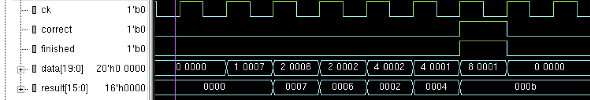
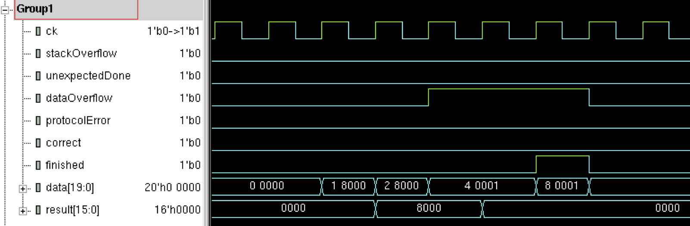
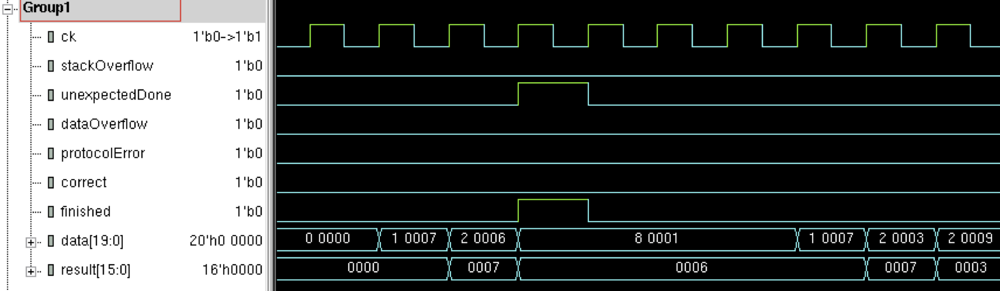

# Assertions Project

18-341: Fall Semester of 2017

## Objective and Overview

The purpose of this project is to get you thinking about testbenches and
concurrent assertions.  You will do so in simulation (of course) by writing a
testbench to test some IP that I give you.  Validation engineering, here you
come!

One day in a steam tunnel inside Hamerschlag Hall, some guy is trying to sell
you IP for a calculator, written in SystemVerilog.  Worse, it’s encrypted
because he doesn’t want to give away how it works.  Knowing there’s no free
lunch, only free HKN snack nights, you are skeptical.  Your goal is to write
testbench code, with properties and concurrent assertions, to check if the
design is correct.

The calculator uses reverse polish notation (RPN), similar to early 
calculators (the ones with the enter button).  The basic idea in RPN
is that two values are sent followed by the command to perform on them (say,
add).  In reality, the strings of values and commands can be longer as this is
all implemented with a stack.  For instance, if you enter three values (a, b,
c) followed by +, -, then the calculation would be a-(b+c).

But your job isn’t to design a calculator. Rather it’s to take someone else’s
design and determine if it’s good enough to buy. Details of the calculator are
presented later. 

This is an **individual** project.

## Schedule and Scoring

Project value | 90 points
--- | ---
Project start | 9 Oct 2017
Project due | 23 Oct 2017 at 12:30pm
Drop dead date | 24 Oct 2017 at 12:30pm

Remember!  You must have committed something by the drop-dead date!  *You must
attempt every project*.

## A Note about Collaboration

This project is to be accomplished individually.  All work must be your own.

Hints from others can be of great help, both to the hinter and the hintee.
Thus, discussions and hints about the assignment are encouraged.  However, the
project must be coded and written up individually (you may not show, nor view,
any source code from other students).  We may use automated tools to detect
copying.

Use Piazza to ask questions or come visit us during office hours (or email for
an appointment at another time).  We want to see you succeed, but you have to
ask for help.

## Your Tasks: A Fault Model and a Testbench

Note again, you’re not designing an RPN calculator — we’re giving you an
encrypted one.  You are to write a testbench for it.  The calculator is a black
box — you will be able to view all the inputs and output but you won’t be able
to see inside.

**What’s the proper viewpoint to take with this project?**  You should develop a
fault model listing the categories of things that could go wrong, and then
provide test vectors and concurrent assertions that will check the calculator
and flag any errors.  It might be handy to start with writing your report, as
you'll need to document your fault model there anyway.

Although you’ll be able to develop a lot of this testbench with our faulty
calculator, that’s not really how it happens in the real world.  Rather, a
validation engineer develops a fault model and testbench based on what
categories of things he/she thinks can go wrong based on a design’s
specification.  When we grade this, there will be a set of calculator faults
that you will have seen before.  There will also be a set you haven’t seen
before.  Will your testbench find those too?  If you did a good job of
developing a fault model and a set of tests for it, the answer should be yes.

**What could be wrong?**  Any validation engineer knows that she or he must 
approach
a design knowing there’s a fault (probably many) in there and it’s her/his job
to find it.  Remember, “I can break anything!”  The approach to take here is
that your stimulus generator will feed inputs to the design.  The properties and
concurrent assertions will watch to make sure that nothing goes wrong.  If
there’s nothing wrong, they should be silent.  After all, your alarm clock
doesn’t wake you up every hour to tell you it’s still set and keeping time!

There could be all sorts of things wrong in this calculator.  Some pretty
obvious once you think about it, and some more on the mean and ornery side.  Our
encrypted calculator will appear to have a fault or two or three (at a time). 
The faults won’t necessarily be simple faults.  The error outputs might not
indicate the correct thing.  Or a calculation might be wrong.  Or, ...

**How will we test your testbench?**  We will provide a testbench that has several
different phases.  For each phase, a different set of faults will be inserted
into the calculator.  In your report, you will make a table with a row for each
phase to summarize what you’ve found.  Realize that assertions aren’t meant to
provide detailed diagnosis.  For instance we wouldn’t expect an assertion to
print “Aha, bit n is stuck at 1”.  But they can point to the fact that a value
was incorrect or showed up at an incorrect time.  From that, you could possibly
deduce/speculate on what might be wrong.

**Testbench software?** Your testbench task sees all the values going into and out
of the calculator so it should be able to do its own calculation.  That is, your
testbench code and assertions can call their own functions and have their own
copies of variables.  Of course, since none of this is to be synthesized, it can
look like implicit FSMs.  Aha! Testbench: software with clock edges. 


## About the Calculator

The calculator will be provided to you as an encrypted file. Its module
header is:

```systemverilog
module TA_calc
 (input  logic        clock, reset_N, 
  input  keyIn        data
  output logic [15:0] result,
  output logic        stackOverflow, unexpectedDone, dataOverflow,
                      protocolError, correct, finished);
```
The data input is a 20-bit structure:

```systemverilog
typedef enum logic [3:0] {START    = 4’h1,
                          ENTER    = 4’h2,
                          ARITH_OP = 4’h4,
                          DONE     = 4’h8} oper_t;

typedef struct packed { // what appears at the data input
  oper_t       op;
  logic [15:0] payload;
  } keyIn_t; 
```

The commands (listed in the enum) are:

* **START** — The data contained in the payload is pushed onto the stack. This
is the start of a calculation, a string of data and commands that will
start with a START command and end with DONE command.

* **ENTER** — The data contained in the payload bits is pushed onto the stack.
 The same thing happens with the data as with START.  However, this is
used for all but the first data entry in a calculation.  (Note that a
whole 16-bit value is the payload. There is no notion of individual keys
for 1, 2, 3, ... to build up a number as with a normal calculator.)

* **ARITH\_OP** — The data contained in the payload bits encodes one of several
operations (commands) to be executed on the top two entries in the
stack.  For some operations, it will only be executed on the top item.

* **DONE** — There is no data with this command (its value is undefined). 
Assert the error and correct outputs (see later).  Ignore inputs until a
START is seen.  The stack is now considered empty.

The unencoded (one-hot) **ARITH_OP** commands are listed below.  In each
case except for **swap**, **pop** and **negate**, the top two elements of the stack
are popped from the stack and the result is pushed on the stack.  In
such a case, the net result is that the commands remove a value from the
stack.  Again, this all happens in one clock cycle.

* **add** — 16’h1.  Top two elements of the stack are added, with the result
placed on top of the stack.  Carry-out bits are ignored.  The total
number of values in the stack is reduced by 1.

* **subtract** — 16’h2.  The operation is second_entry – top_entry.  The total
number of values in the stack is reduced by 1.

* **and** — 16’h4.  The total number of values in the stack is reduced by 1.

* **swap** — 16’h8.  The top two elements are swapped. The total number of
values in the stack remains the same.

* **negate** — 16’h10.  The top element of the stack is negated (2's comp). 
The total number of values in the stack remains the same.

* **pop** — 16’h20.  The top of the stack is popped. The total number of
values in the stack is reduced by 1.

When an error occurs, one of the error outputs are asserted, and the
operation’s result is put on the stack as defined below.  The error
indicators remain asserted until **DONE** is the current command.  In these
cases, the calculator finishes the current operation and then stops
doing any actions except for waiting for **DONE**.  However, the
**unexpectedDone** output is one exception to this, see details below.  If
there has been no errors when the command is completed, **correct** is
asserted.  When the command is complete, **finished** is asserted,
regardless if there is an error or if **correct** is asserted.

Error outputs:

* **stackOverflow** — Not just a popular website, this output indicates that
anytime between **START** and **DONE**, a value has been lost off the bottom of
the stack. i.e., more values have been pushed on the stack than can be
held in the places in the stack. The stack has 8 places.

* **unexpectedDone** — When the command is **DONE**, there should be one and only
one value on the stack (the result).  If that’s not true, this error is
asserted for one clock period.  When this is asserted, **finished** is as
well.  It then waits for the next **START**.

* **dataOverflow** — an **ARITH_OP** resulted in a two's complement overflow.

* **protocolError** — This is the OR of several possible things:

  * there aren't enough items on the stack to do the specified operation;

  * **START** appears again before DONE;

  * between **START** and **DONE**, there should always be at least one 
    element in the stack (never 0) — **START** puts the first one there, 
    and **DONE** leaves the last one (the result) on the stack.

  * the command is invalid. e.g., something other than the numbers given, 
    or multiple commands at once.

Non-error outputs:

* **correct** — **DONE** is on the input and there are no errors (the above
items).

* **finished** — **DONE** is on the input regardless of whether there are some
errors.

* **result** — The 16-bit value on the top of the stack is the result of all
the calculations.  It is connected to the module outputs.

* **stackOut** - Your view of the stack.  This one is important, as you'll want to 
ensure the stack holds what you think it should.  So, after you have done a 
**START** command with payload **8'h87**, you can check **stackOut[0]** to see if
the top of the stack holds the **8'h87** or not.

## A Few Timing Diagrams

The first diagram shows: a **START** command pushing 7 on the stack, an
**ENTER** pushing 6, another **ENTER** pushing 2, a **subtract** 
command which does (6-2=4), an **add** command producing 7+4=11 (**'hb**), 
and a **DONE** command.  When the **DONE** command is on the input, 
**correct** and **finish** are also asserted because there were no errors.



The second diagram illustrates a **dataOverflow** error.  **16’h8000** is pushed
with a **START** command.  Then the same value is entered on the stack. 
Then an **add** appears on the input.  This will cause a two's complement
overflow because you added two negative numbers (top bit set) and got a
positive result (0).  The **dataOverflow** error bit displays
combinationally because of the command on the input and the two values. 
It stays asserted until a **DONE** command comes along.  Also, **finished** is
asserted with the **DONE**.  However, **correct** is not asserted because of the
error.



In this third example, after two values (7 and 6) are pushed on the
stack, **DONE** appears on the input.  This is an **unexpectedDone** error.  The
system waits for a **START**, which later arrives.



## Model Organization and Simulation

In the repo, you will find
**top.sv**, which will instantiate our encrypted calculator with the port
specifications as given earlier.  The testbench you write in this file
will be similar to other testbenches you’ve written (you can have other
**.sv** files as part of your testbench too).  First, the similarities:
you’ll set up a **clock** and handle **reset**.  The differences are that
instead of writing an initial block with an implicit FSM in it to drive
the calculator’s inputs, you will write a SystemVerilog task with an
implicit FSM to do that.  You will also have properties and concurrent
assertions that will check the calculator’s response to your test
vectors.  The task, called **runTestbench**, will be called from an initial
block inside our broken calculator.

Why this organization?  Inside our encrypted calculator, we will have an
initial block that will insert some faults into the design.  By insert a
fault we mean that we will change some of the calculator’s
functionality, making some part of it incorrect.  The pseudo-code for
the function of our initial block looks something like this: 

```systemverilog
int phase;
for (phase = 1; phase < someNumber; phase++) begin 
  insert faults of current phase; 
  call your task runTestbench(phase); 
  remove inserted faults; 
end 
$finish; 
```

Each phase inserts a different fault (or faults) into the calculator. 
Task **runTestbench** is called with the phase number as an argument which
you could use in $display commands, etc.  You really shouldn't use this
phase number for much else.  You must not have a bunch of tests that are
specific to a phase number, for instance.  Rather your **runTestbench** task
will apply the same set of test vectors (or a bunch of random vectors)
during each phase.  Your concurrent assertions will always be active.

You may have tasks/functions called by **runTestbench** and by assertions. 
Your testbench file(s) also has all of the properties and assertions in
it. 

## Your runTestbench Task

When we call your **runTestbench** task, it will begin executing its
statements.  These will set the calculator inputs using non-blocking
assignments (**<=**).  When execution reaches **endtask**, the task will return
to the caller.  Don’t put a **$finish** in your task.  Our code will call
**$finish**.

In **top.sv**, I've started you off with a very simple testbench.  It is an
example of adding 5 + 3 — in a 240-style testbench style, which we all
know "tests everything."  Note that it is writing values to **data**, for
instance, which is the input to the calculator.  Even though “data” is
not defined within the task’s scope (**task...endtask**), it can write to
the variables in the module’s scope where **data** is defined.  You would
also put your assertions and properties in this file too. 

## SystemVerilog things

In class (and in the book) we’ve covered random variables with
constraints, queue data types (that can also be used as stacks!),
assertions, tasks, functions, etc. You should try to use these in your
code. They come under the phrase “appropriately written.” 

Things not to do: 
* Don’t use SystemVerilog **program** constructs. We won’t either. 
* Don’t call **$finish**, we will. 
* Don’t design your own RT level calculator to test against ours —
you’ll lose lots of points for that.  You may have some software-ish
code that keeps track of what values should appear, but that’s about it.
 Rather you should have lots of concurrent assertions but they should
_NOT_ be of the type 

```systemverilog
property (xyzzy) @(posedge clock) 
  faultyCalculatorOutput == myCalculatorOutput 
endproperty
```

* Don't forget that assertions are invariants about a design.  You
should not have a variable that turns off an assertion based on what
phase the testbench is in. e.g., like 

```systemverilog
property (konami) @(posedge clock) 
  (phase == 3 && someSignal) |=> ... 
```

## For You

In the repo, you will find the following files:

* **top.sv** — This file is the one shown above. Copy it to your working
  directory and add to it. 

* **TA_calc_broken.svp** — The broken calculator. It will call your 
  **runTestbench** task. 

* **TA_calc_golden.svp** — The calculator with no faults. It will call your 
  **runTestbench** task. 

* **Makefile** — A makefile that can be used to build the system with
either the broken calculator or the golden calculator. We provided a
starter makefile in the handout area — start with it. 

If you change anything in the makefile, make sure we can still run the 
system with the following commands: 

```bash
make broken
make golden
```

## For Credit

Submit your SystemVerilog modules “appropriately” written.  e.g., clean
writing style and correct use of SV language semantics.  Concurrent
assertions!  Lots of concurrent assertions!  Comments!

Of course, submission is done by tagging (yes, using a git tag) some 
commit with 'Final'.

Turn in a report describing your fault model.  What could go wrong? 
Explain how your testbench properties and assertions test for these
faults.

Include in the report a table with a row for each phase to summarize
what you've found.  Explain or speculate on what is wrong in each phase.

Schedule a demonstration with the TAs.  We will watch your demo and
question you about your code and assertions.  We will run this with the
broken calculator provided.

We will then add another fault or two to see if you can find it and
explain it from your testbench output.  After all, that's what
verification engineering is all about.

## Demos and Lateness

Same as in previous projects, you will demo outside of class times on or
near the due date.

* **Grace Day:**  You may use your grace day to turn in the solution up
to 24 hours late.  If you do not intend to use a grace day (or have
already used yours), make sure you have _something_ committed and pushed
at the deadline to avoid getting a zero on this project.
